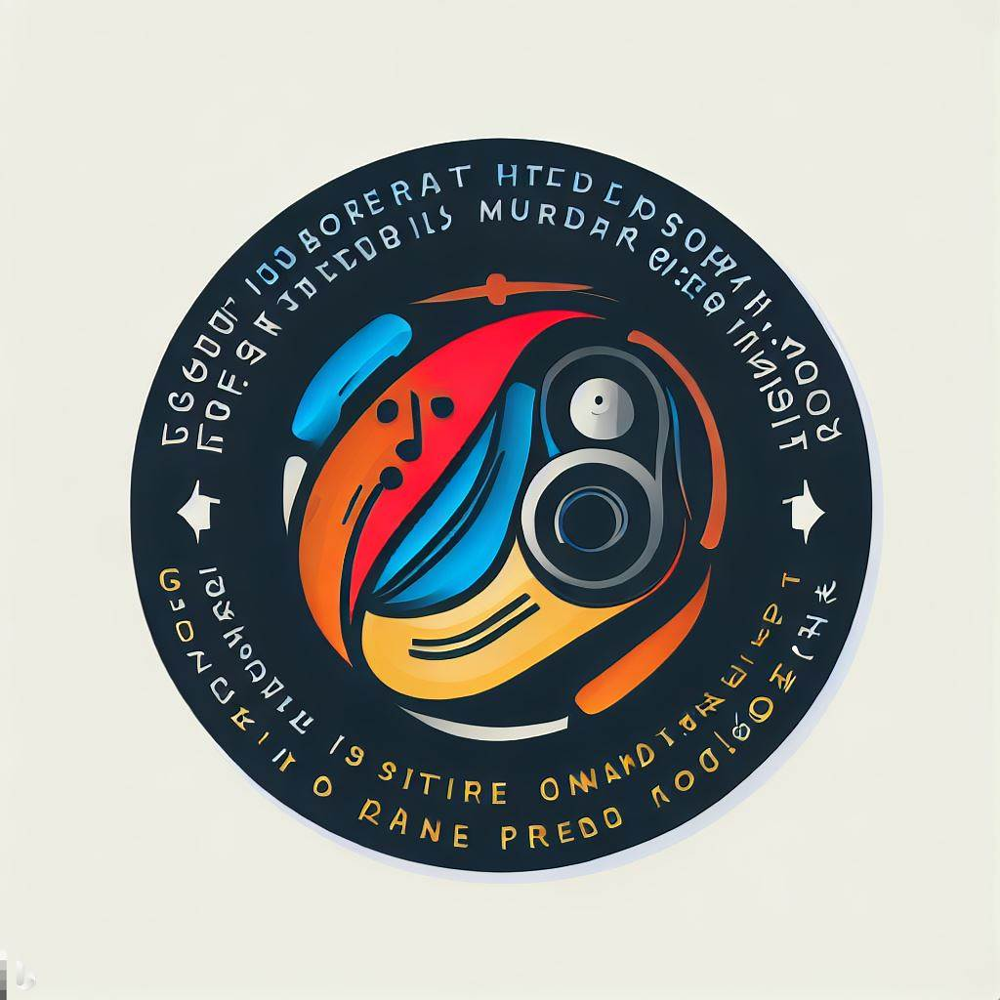
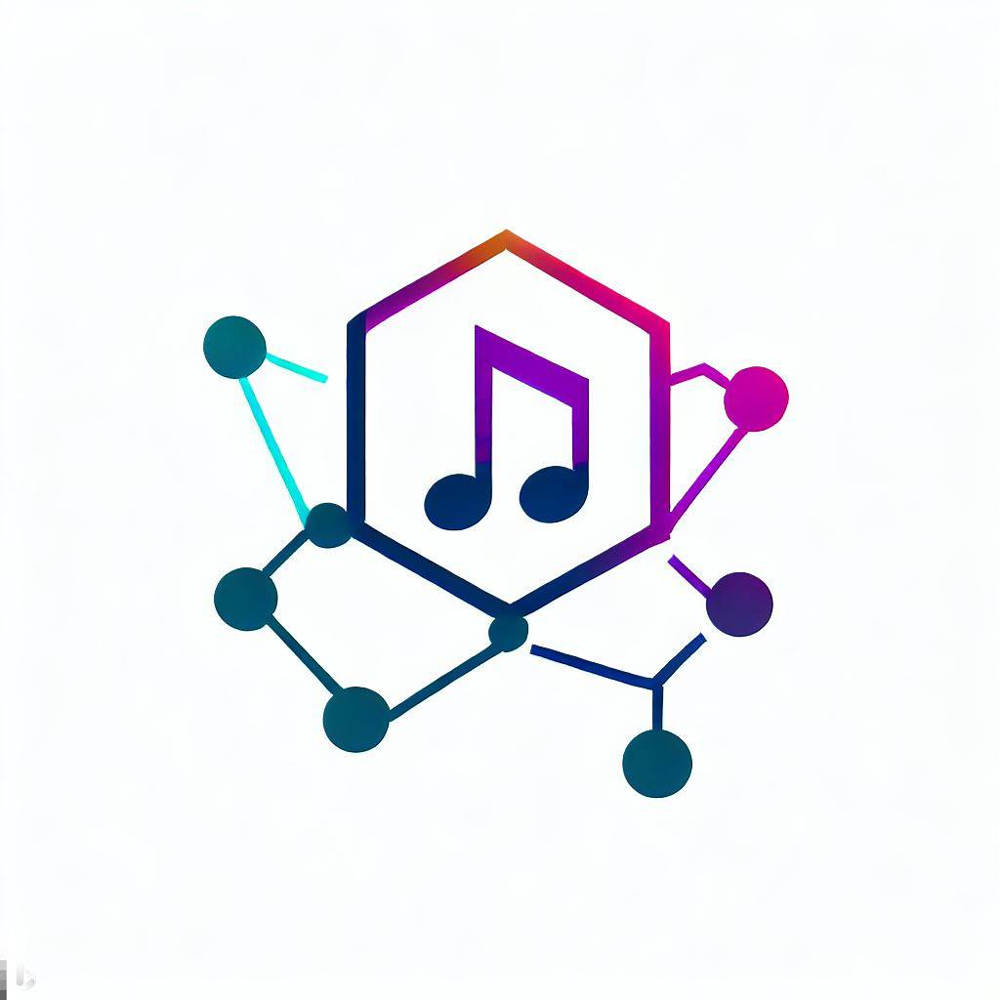

<h1 align="center">Some AI-generated logos for this project</h1>
<p>
  <a href="http://nestjs.com/" target="blank"></a>
  <a href="http://nestjs.com/" target="blank"></a>
  <a href="http://nestjs.com/" target="blank"></a>
  <a href="http://nestjs.com/" target="blank"></a>
</p>

[circleci-image]: https://img.shields.io/circleci/build/github/nestjs/nest/master?token=abc123def456
[circleci-url]: https://circleci.com/gh/nestjs/nest

  <p align="center">This project developed by <a href="http://nestjs.com/" target="_blank">Nest.js</a> framework based on microservice architecture</p>
  <p align="center">you can find the base services <a href="https://github.com/mehdiqor/nest-auth" target="_blank">here</a></p>
    <p align="center">

## Description

This repsitory contains 3 services:

1. **Music-Service:** artists can add their albums and tracks<br>
   And the music file is uploaded to google-storage

2. **Film-Service:** directors can add their movies<br>
   And the cover of the movie is uploaded to google-storage

3. **Elasticsearch-Service:** In this project, the CQRS pattern is used<br>
   Users can search and find the movie and music they want from elasticsearch<br>

you can access the base service repository from this [link](https://github.com/mehdiqor/nest-auth).

## Installation and Running the app

```bash
# first, enter the desired service
$ cd SERVICE_NAME

# docker compose
$ docker-compose up -d

# install with yarn
$ yarn
$ yarn install

# development
$ yarn run start

# watch mode
$ yarn run start:dev

# production mode
$ yarn run start:prod
```

## Stay in touch

- Author - [Mehdi Ghorbani](https://github.com/mehdiqor)
- Telegram - [Mehdi_qor](t.me/Mehdi_qor)
- Email - [mehdighorbanin@gmail.com](mailto:mehdighorbanin@gmail.com)
